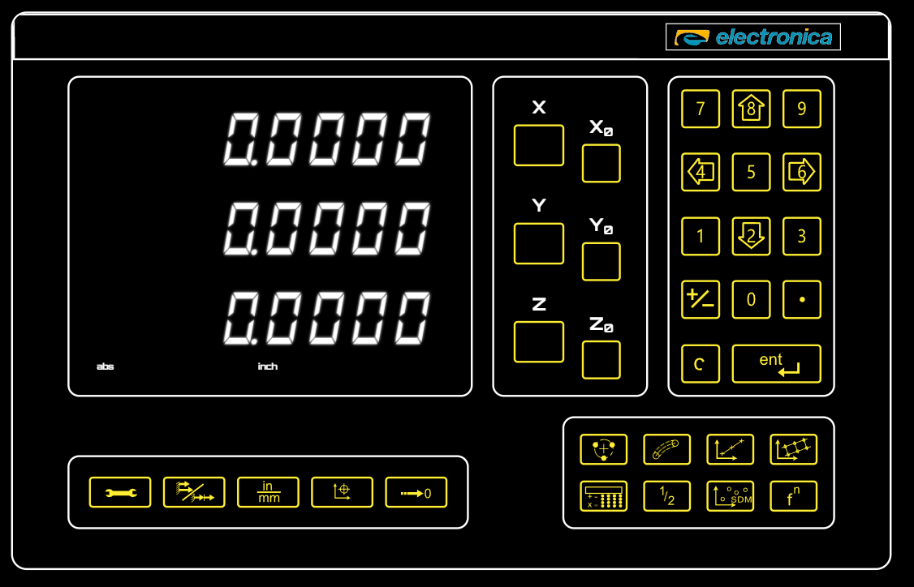

# Accessibility

The EL400 Digital Readout Simulator is designed to be accessible to users with visual impairments, motor impairments, and those who rely on assistive technologies.

## Standards Compliance

This project targets **WCAG 2.1 Level AAA** compliance where applicable, with particular focus on:

- **Contrast Requirements**: Exceeds Level AAA (7:1) with 20:1 for display segments and 17:1 for buttons
- **Keyboard Accessibility**: All interactive elements are keyboard navigable
- **Screen Reader Support**: Comprehensive ARIA labels and live regions

## Features

### Screen Reader Support

- All interactive elements have descriptive text via `sr-only` class (preferred over `aria-label`)
- Axis displays use `aria-live="polite"` regions in an accessible table to announce position changes
- Mode indicators use native `<fieldset>` with `<legend>` for semantic grouping
- LED indicators are non-interactive disabled radio buttons showing current state
- Buttons use `aria-pressed` to indicate active/selected states
- Section headings use `sr-only` class (e.g., "Numeric keypad", "Primary functions")
- Decorative icons use `aria-hidden="true"` to avoid screen reader noise

### Keyboard Navigation

- All buttons and controls are focusable and operable via keyboard
- Focus rings provide clear visual indication of the current focus
- Enter and Space keys activate buttons consistently
- **Keypad follows natural numeric tab order**: 1→2→3→4→5→6→7→8→9→0→±→.→C→Enter
- Arrow keys on keypad have directional hints (e.g., "8 (Up)", "4 (Left)")

### Touch Support

- Large touch targets designed for shop floor use with gloves
- Buttons sized appropriately for touch interaction
- No hover-dependent functionality

### Windows High Contrast / Forced Colors Mode

The simulator fully supports Windows Forced Colors mode (High Contrast), ensuring users with low vision or light sensitivity can use the application with their preferred system color scheme.


*The DRO simulator in Windows Forced Colors mode using the Night Sky theme*

#### Implementation Details

**Seven-Segment Display**
- Lit segments use `CanvasText` system color for maximum contrast
- Unlit segments use `transparent` fill to blend with background
- Achieved contrast ratio: 20:1 or greater

**Buttons and Controls**
- All buttons have visible 2px transparent borders that become visible in forced-colors mode
- Button text uses system colors automatically
- Achieved contrast ratio: 17:1 or greater

**Mode Indicators**
- Active indicators (ABS/INC, IN/MM) display clearly in system highlight colors
- Inactive indicators blend with background to reduce visual noise

**SVG Icons**
- All SVG icons include forced-colors media query styles
- Icons use `ButtonText` system color for strokes and fills

#### CSS Media Query

```css
@media (forced-colors: active) {
  .segment-on { fill: CanvasText; }
  .segment-off { fill: transparent; }
}
```

## Testing

### Automated Testing

- **Unit tests**: ARIA attributes and roles verified via Testing Library
- **E2E tests**: Playwright tests with `forcedColors: 'active'` context option
- **Contrast verification**: Automated contrast ratio calculations in E2E tests

### Manual Testing Recommended

- Test with Windows Narrator
- Test with NVDA or JAWS screen readers
- Test with various Windows High Contrast themes
- Test keyboard-only navigation

## Component-Level Accessibility

| Component | ARIA Support | Keyboard | Forced Colors |
|-----------|--------------|----------|---------------|
| Seven-Segment Display | `aria-live` in accessible table | N/A (display only) | 20:1 contrast |
| Axis Buttons | `aria-pressed`, sr-only text | Enter/Space | Visible borders |
| Zero Buttons | sr-only text | Enter/Space | Visible borders |
| Numeric Keypad | sr-only heading + button text | Tab (1-9,0 order), Enter/Space | Visible borders |
| LED Indicators | Disabled radio in `<fieldset>` | N/A (display only) | System colors |
| Function Buttons | sr-only text | Enter/Space | Visible borders |
| Icons | `aria-hidden="true"` | N/A (decorative) | System colors |

## References

- [WCAG 2.1 Guidelines](https://www.w3.org/WAI/WCAG21/Understanding/)
- [WCAG 2.1 Contrast (Enhanced)](https://www.w3.org/WAI/WCAG21/Understanding/contrast-enhanced)
- [CSS Forced Colors Mode](https://developer.mozilla.org/en-US/docs/Web/CSS/@media/forced-colors)
- [Windows High Contrast Mode](https://support.microsoft.com/en-us/windows/change-color-contrast-in-windows-fedc744c-90ac-69df-aed5-c8a90125e696)
- [ARIA Authoring Practices](https://www.w3.org/WAI/ARIA/apg/)
