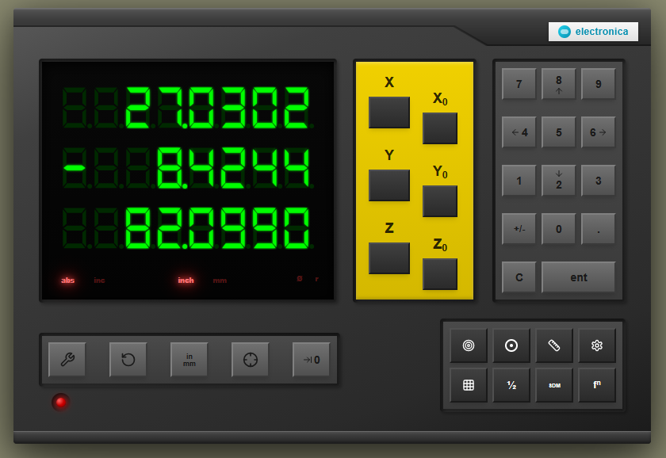

# EL400 Digital Readout (DRO) Simulator

A faithful web-based simulator for the Electronica EL400 (a.k.a. MagXact MX-100M) digital readout (DRO) system.

**Live version**: [el400.vza.net](https://el400.vza.net)



## Overview

CNC milling machine users sometimes need to operate their machines in fully manual mode, using a [pendant controller](https://github.com/pedropaulovc/whb04b-6) for precise jogging and positioning. However, current G-code sender applications are not optimized for this workflow.

### The Problem with Current G-Code Senders

Popular G-code senders like [CNCjs](https://github.com/cncjs/cncjs) and [Universal Gcode Sender (UGS)](https://github.com/winder/Universal-G-Code-Sender) are designed primarily for mouse and keyboard interaction. Their interfaces are cramped and difficult to use on touch screens:

| CNCjs | Universal Gcode Sender |
|-------|------------------------|
|  |  |
| *Dense UI with small buttons* | *Complex panels optimized for desktop* |

More importantly, these G-code senders lack essential machinist calculator functions that traditional DRO units provide out of the box:

| Feature | EL400 DRO | CNCjs | UGS |
|---------|-----------|-------|-----|
| Half Function (centerline finding) | Yes | No | No |
| Built-in Calculator | Yes | No | No |
| Bolt Hole Circle | Yes | No | No |
| Bolt Hole Arc | Yes | No | No |
| Linear Hole Patterns | Yes | No | No |
| Grid Patterns | Yes | No | No |
| Center of Circle (3-point) | Yes | No | No |
| Center of Line | Yes | No | No |
| Arc Contouring | Yes | No | No |
| Taper Calculations | Yes | No | No |
| Distance to Go | Yes | Partial | Partial |
| Sub-Datum Memory | Yes | No | No |

### The Solution

This project recreates the EL400/MX-100M DRO interface as a web application, designed to be integrated with G-code senders. When displayed maximized on a touch screen alongside a pendant controller, it provides ergonomics equivalent to manual milling machines equipped with a traditional DRO unit.

The simulator focuses on:
- **Touch-friendly interface**: Large buttons and displays optimized for shop floor use
- **Complete machinist functions**: All the calculator features machinists expect from a DRO
- **Accessibility**: WCAG compliance, keyboard navigation, screen reader support, forced-colors mode ([details](ACCESSIBILITY.md))
- **Accurate reproduction**: Faithful recreation of the original hardware's behavior

## Project Info

**Live version**: [el400.vza.net](https://el400.vza.net)

**Lovable project URL**: https://lovable.dev/projects/269190d5-da7b-4375-80fd-1a9891f19e6a

## Tech Stack

- Vite
- TypeScript
- React
- shadcn-ui
- Tailwind CSS

## Getting Started

### Prerequisites

- Node.js & npm - [install with nvm](https://github.com/nvm-sh/nvm#installing-and-updating)

### Installation

```sh
# Clone the repository
git clone <YOUR_GIT_URL>

# Navigate to the project directory
cd <YOUR_PROJECT_NAME>

# Install dependencies
npm i

# Start development server
npm run dev
```

## How to Edit This Code

**Use Lovable**

The [Lovable Project](https://lovable.dev/projects/269190d5-da7b-4375-80fd-1a9891f19e6a) is public. Click the **Remix** button to create your own copy and start prompting.

**Use your preferred IDE**

Clone this repo and push changes.

**Edit a file directly in GitHub**

- Navigate to the desired file(s).
- Click the "Edit" button (pencil icon) at the top right of the file view.
- Make your changes and commit the changes.

**Use GitHub Codespaces**

- Navigate to the main page of your repository.
- Click on the "Code" button (green button) near the top right.
- Select the "Codespaces" tab.
- Click on "New codespace" to launch a new Codespace environment.
- Edit files directly within the Codespace and commit and push your changes once you're done.

## DRO Specifications

The simulator behavior is based on official manuals:
- [EL400 Operation Manual](https://www.dropros.com/documents/EL400%20OpManual.pdf)
- [MagXact MX-100M Manual](https://cdn.shopify.com/s/files/1/0576/0984/6859/files/MagXact-MX-100M-Mill-DRO-V1-9-1-2021.pdf)

## License

MIT License - see LICENSE file for details
