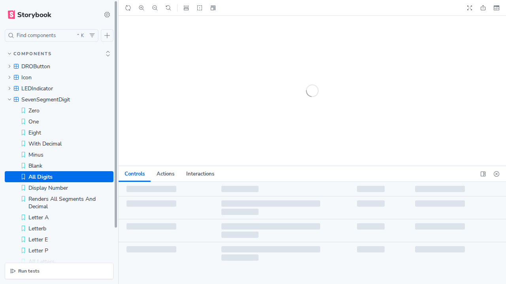
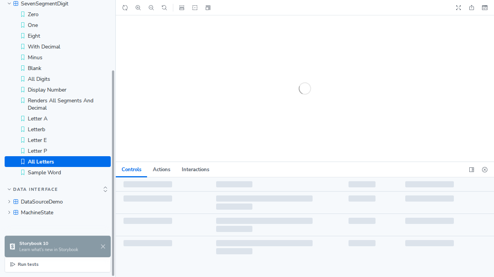
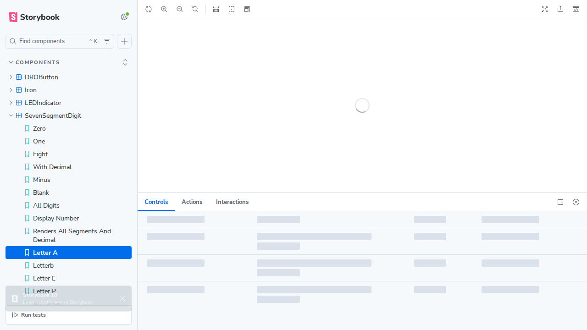
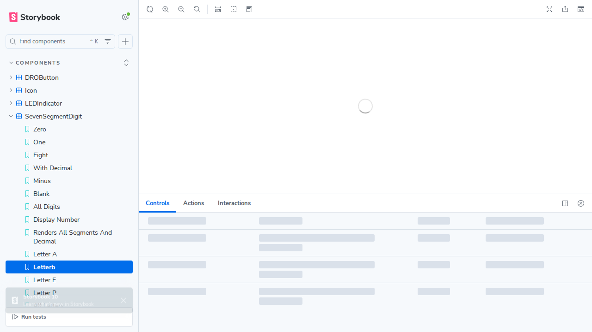
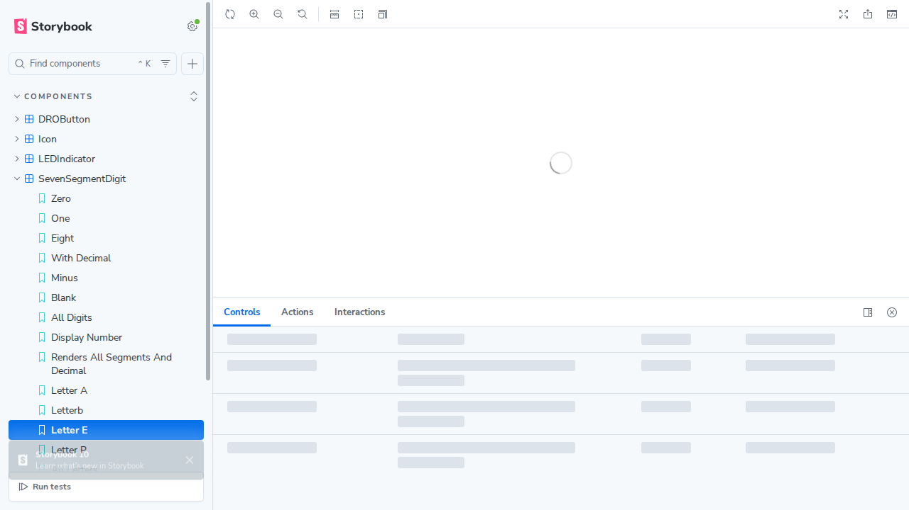
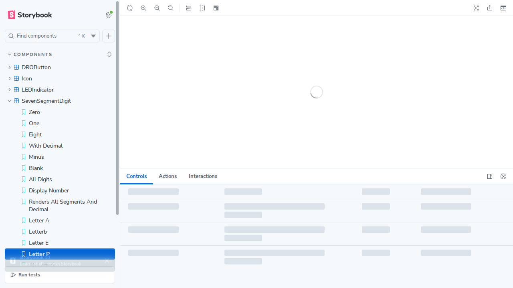
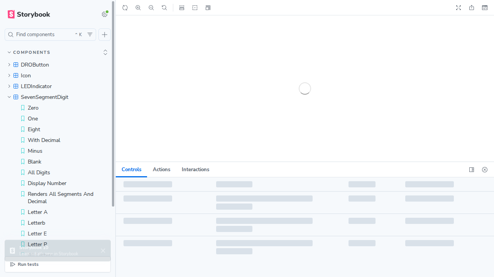

# Seven Segment Display Character Screenshots

This directory contains screenshots of the SevenSegmentDigit component displaying various characters.

## Screenshots

### All Digits

Shows all digits 0-9 displayed on seven-segment displays.

### All Letters

Shows all supported letter characters displayed on seven-segment displays, including:
- A, b, C, c, d, E, F, G, h, I, i, J, L, l, n, m, P, r, S, t, U, v, X, Y

### Individual Character Examples

#### Letter A

#### Letter b (lowercase)

#### Letter E

#### Letter P

### Sample Word: "hELL"

Demonstrates how multiple seven-segment digits can be combined to display words.

## Supported Characters

The component now supports:
- **Digits**: 0-9
- **Symbols**: - (minus), (space)
- **Letters**: A, b, C, c, d, E, F, G, h, I, i, J, L, l, n, m, P, r, S, t, U, v, X, Y

## Case Sensitivity

The component is **case-sensitive**. For example:
- 'C' and 'c' are both supported but render differently
- 'A' is supported but 'a' is not (will throw an error)

## Error Handling

The component throws an error if an unsupported character is provided, with a helpful message listing all supported characters.
