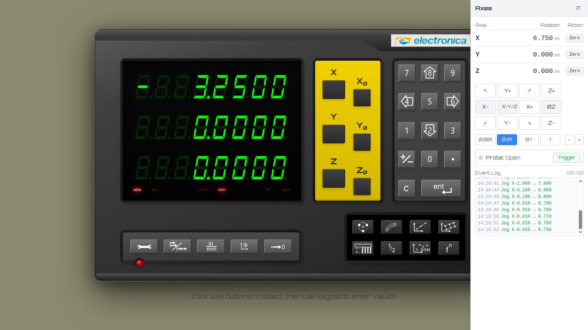
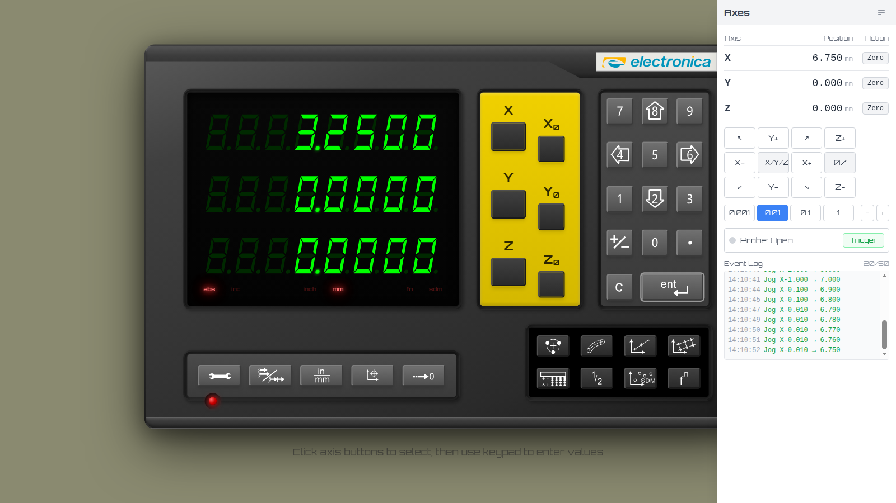
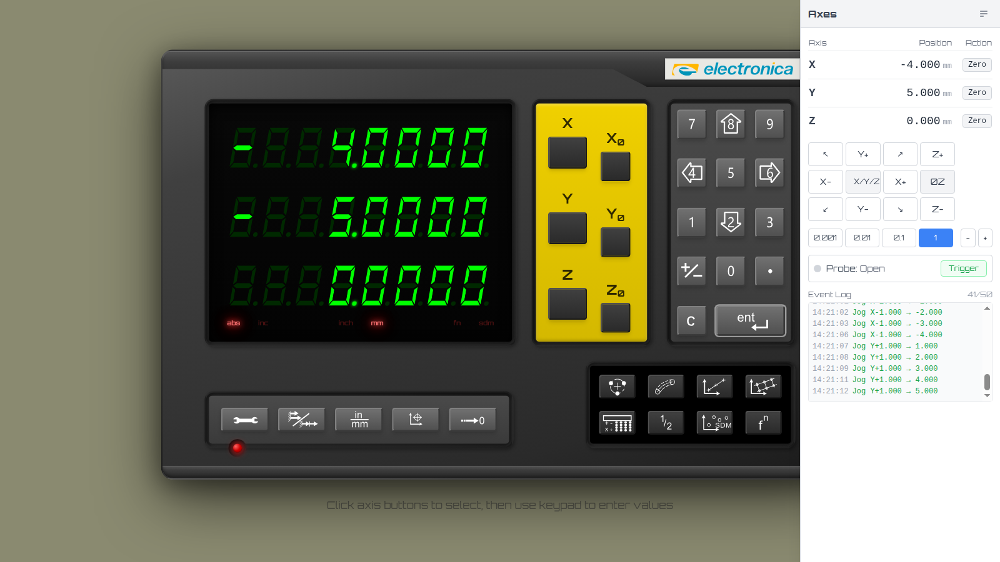
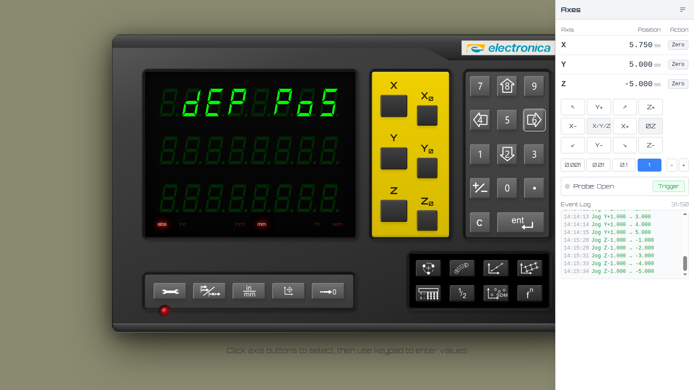
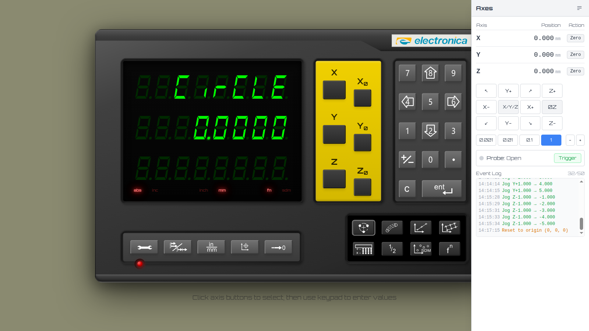

# Demo — US-002: Sign Convention & Axis Direction

Manual walkthrough of US-002 on the EL400 DRO simulator, driven entirely through
real user actions (debug-mode jog controls + the on-screen setup menu and keypad).
No test harnesses, mocks, route interception, or store mutation were used — every
position came from the jog controls (a machinist's handwheel) and every preference
change came from the on-device setup menu.

**Spec:** `project/user-stories/01-foundation/US-002-sign-convention.md` (AC 2.1–2.6)
**Branch:** `feat/us-002-sign-convention`
**How this was run:** `npm run dev` in the worktree → Chrome (headed) on
`http://localhost:8081/?source=debug`. The right-hand panel is the debug control
panel; its jog buttons (`X+`/`X-`/`Y±`/`Z±`) and step-size buttons (0.001 … 1)
move the simulated table exactly as an operator's handwheel would. The DRO display
is the seven-segment readout on the left. Units were switched to **mm** (via the
on-device `in/mm` button) so jog distances map 1:1 to the readout.

A note on reading values: the seven-segment digits are SVG glyphs, so each axis
also exposes a screen-reader cell carrying the exact signed value (e.g. `-3.2500`).
Every value quoted below was read from that cell and confirmed against the
seven-segment display in the screenshot.

---

## Step A — Baseline (boot to idle)

The simulator boots to idle with all three axes reading `0.0000` and the machine at
the origin.

---

## Step A — AC 2.1: tool's-eye +X increases the displayed value

Under the standard convention, moving the **tool** in +X (the table moves left)
must **increase** the displayed value. Jogging `X+` ten times at step 1 mm moves the
machine to +10 mm; the readout shows **`10.0000`**, positive, with no sign.

> AC 2.1 ✓ — +X tool motion increases the displayed value.

---

## Step B — AC 2.6: negative values show a leading minus

Zeroed X at the +10 position (new datum), then jogged `X-` back to −3.250 mm
(steps 1 / 0.1 / 0.01). The X readout shows **`-3.2500`** with a clear leading
minus glyph, while Y and Z stay `0.0000` with no sign.

> AC 2.6 ✓ — negatives carry a leading `-`; positives carry no sign.

---

## Step C — AC 2.2: the Direction parameter flips the sign

This is the headline behaviour. The per-axis Direction is changed through the real
setup menu: **Settings (wrench) → Select X → 2/8 to scroll → 4/6 to cycle → End +
ent to exit**.

The X axis Direction parameter, default `LEFt` (standard/normal):

Cycling it with the `6` (Right) key sets it to `riGht` (reversed). The value commits
immediately (persisted to non-volatile memory on the keypress):

Exiting setup — **without moving the table** — the *same physical position* that read
`-3.2500` now reads **`3.2500`** (positive). The sign flipped end-to-end purely from
the menu change:

> AC 2.2 ✓ — flipping the Direction parameter flips the displayed sign.

### The flip persists across subsequent moves

With X reversed, jogging the machine **X− by 1 mm** (machine 6.750 → 5.750 mm) makes
the readout **increase** from `3.2500` to **`4.2500`** — the opposite of the standard
convention, confirming the reversed sense applies to every later move, not just the
static value:

### The toggle is reversible

Cycling Direction back to `LEFt` (the `4`/Left key) restores the standard convention:
the same position flips back to **`-4.2500`** (machine 5.750 − datum 10.0):

> AC 2.2 ✓ — round-trips cleanly; the preference persists in non-volatile memory.

---

## Step D — AC 2.2: per-axis isolation

Direction is independent per axis. Starting from X = `-4.0000` and Y = `+5.0000`
(both axes normal):

Flipping **only Y** to `riGht` flips Y from `+5.0000` to **`-5.0000`**, while X stays
exactly at **`-4.0000`** (unchanged). Stored directions: `{X: normal, Y: reversed,
Z: normal}`.

> AC 2.2 ✓ — flipping one axis does not disturb the others.

---

## Step E — AC 2.4: Z depth-sense preference (depth-positive)

A machinist who zeroes Z at tool-touch and prefers "deeper = bigger number" can flip
a global preference. Plunging Z into the cut (machine Z = −5.000 mm) shows, under the
default `dEP nEG`, a negative reading **`-5.0000`**:

The global Z depth-sense parameter in the setup menu (`dEP nEG` / `dEP PoS`):

Switching to `dEP PoS` and exiting — *with the table unmoved* (machine Z still
−5.000 mm) — inverts the Z readout to **`5.0000`**. Now increasing cutting depth
increases the displayed value:

> AC 2.4 ✓ — depth-positive is a real, user-reachable setup-menu preference.

---

## Step F — AC 2.5: macros use the standard convention regardless of Direction

Pre-programmed macros must compute hole coordinates in the canonical convention so
generated holes land where the figures show, no matter what Direction preference the
operator set for the readout.

From the origin, ran a **Bolt hole → CIRCLE** macro: center (0, 0), radius 10,
start angle 0°, 4 holes.

Hole 1 (angle 0°, radius 10) sits at canonical (x = 10, y = 0). With **X direction
NORMAL**, the distance-to-go reads **X = `10.0000`**:

Then set **X direction = reversed** and re-ran the *identical* bolt circle. The
hole-1 distance-to-go still reads **X = `10.0000`** — unchanged. If the Direction
preference leaked into macro math, this would read `-10.0000`; it does not.

> AC 2.5 ✓ — macro coordinates are invariant to the operator's Direction preference.

---

## Acceptance-criteria coverage

| AC | What was shown | Result |
|----|----------------|--------|
| 2.1 | +X tool motion (table-left) increased the readout to `10.0000` | ✓ |
| 2.2 | Direction `LEFt`↔`riGht` flipped the sign; persisted across moves; per-axis isolated; round-tripped | ✓ |
| 2.3 | Datum dependence (covered by unit tests; partially visible via re-zero between Steps A–B) | ✓ (unit) |
| 2.4 | Z depth-sense `dEP nEG`↔`dEP PoS` inverted the Z readout for a fixed depth | ✓ |
| 2.5 | Bolt-circle hole coordinates unchanged with X reversed | ✓ |
| 2.6 | Negatives showed a leading `-`; positives showed none | ✓ |

All Direction and Z-depth changes were made through the on-device setup menu; all
positions came from the debug jog controls. Both preferences commit immediately to
non-volatile memory on the keypress and survive later moves.
