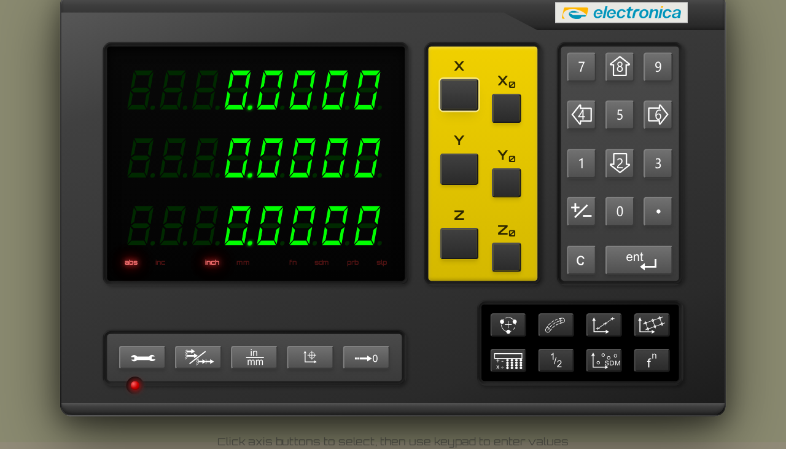
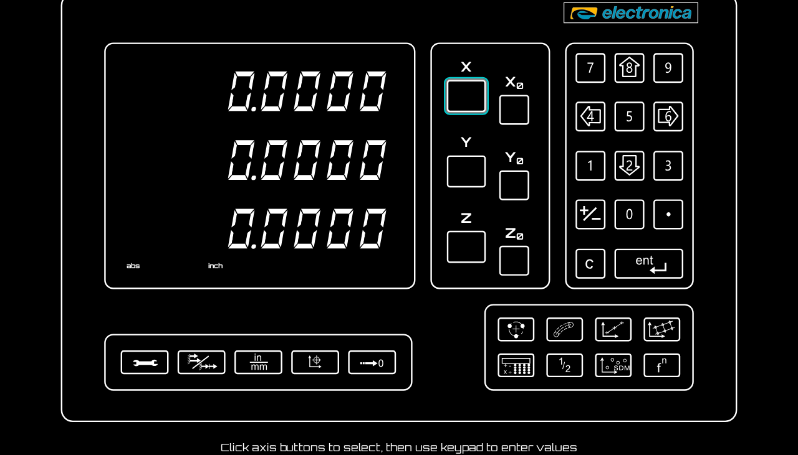
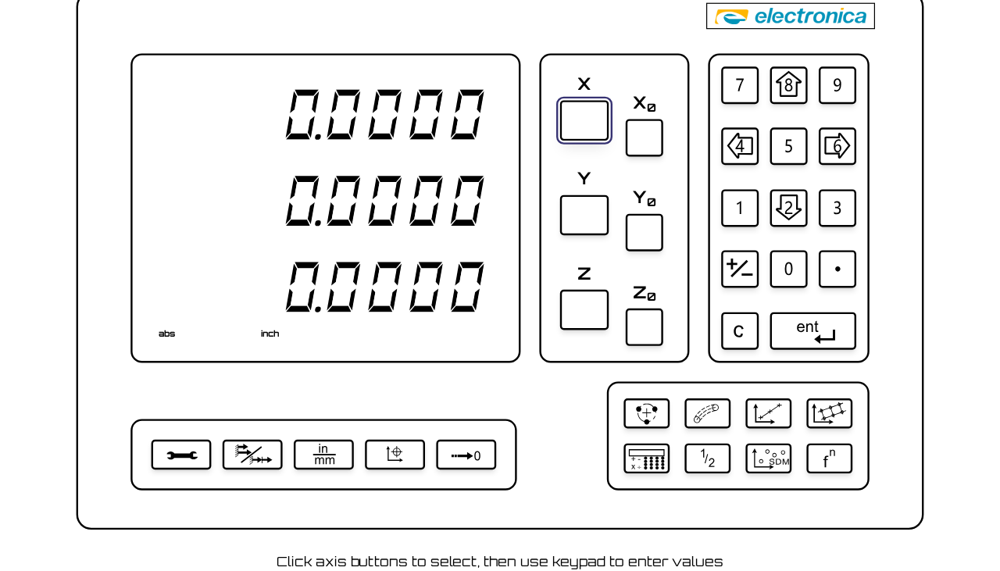

# US-034 Demo — Forced Colors Mode (Windows High Contrast)

Manual demo of the EL400 DRO under **forced-colors mode** — the rendering path
Windows High Contrast triggers via `@media (forced-colors: active)`. This closes
the gap in the US-048 accessibility retest, which demoed screen-reader semantics
but never visually exercised the high-contrast experience.

## How this was produced

`capture.ts` drives the **real app** (dev server) in a Chromium context with
Playwright's `forcedColors: 'active'` emulation — the same CSS path the OS setting
activates, not a mock or override. It performs a real user action (select the X
axis), screenshots three states, and reads back computed styles to compute each
AC's contrast ratio with the project's own `src/tests/contrast-utils.ts`. Re-run:

```bash
npm run dev -- --port 9123        # in one shell
npx tsx spec/demo/us-034-forced-colors-mode/capture.ts
```

Full numeric output: [ac-verification.txt](./ac-verification.txt).

## Step 1 — Normal mode (baseline, for comparison)



The DRO in its designed theme: green seven-segment readout on near-black, grey
bevelled buttons, red mode glow. The forced-colors AC thresholds **do not apply
here** (the `check` markers in the log on this row are expected, not failures) —
this image exists only to show what changes when High Contrast is on.

## Step 2 — Forced colors, dark theme



Everything re-maps to system colors: lit segments and all text/borders/icons use
`CanvasText` (white) on a `Canvas` (black) background; the selected **X** axis
button picks up the system `Highlight` accent (cyan). Unlit segments and inactive
indicators drop to `transparent`, so they vanish into the background. The red LED
glow (`text-shadow`) is stripped so it can't muddy contrast.

## Step 3 — Forced colors, light theme



The same UI under a light High Contrast theme: black-on-white, every control still
clearly bordered and legible, the selected axis showing the light theme's
`Highlight` accent. Demonstrates the implementation honors whatever system palette
the user has chosen, not a hard-coded one.

## Acceptance criteria — verified in BOTH high-contrast themes

| AC | Requirement | Dark | Light | Evidence |
|----|-------------|------|-------|----------|
| 34.1 | Lit segments ≥ 20:1 vs background | 21.0:1 | 21.0:1 | PASS |
| 34.2 | Unlit segments visually distinct from lit | ✓ | ✓ | PASS |
| 34.3 | Unlit segments + inactive indicators ≈ 1:1 (blend in) | 1.00:1 | 1.00:1 | PASS |
| 34.4 | All buttons have visible borders | 2px solid | 2px solid | PASS |
| 34.5 | Button colors distinct from segment colors | face≠fill | face≠fill | PASS |
| 34.6 | Buttons ≥ 17:1 vs background | 21.0:1 | 21.0:1 | PASS |
| 34.7 | All interactive elements remain identifiable | ✓ (borders + accent) | ✓ | PASS |
| 34.8 | Active mode indicators clearly visible, no glow | 21.0:1, shadow=none | 21.0:1, shadow=none | PASS |

All real UI actions, no forced state beyond the OS-level forced-colors emulation
itself. This complements the automated coverage (US-034 e2e smoke test + the
`*.forced-colors.stories.tsx` Storybook tests, both green in CI).
