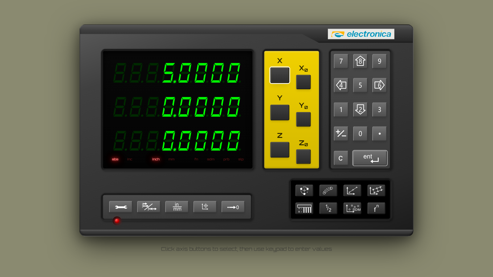

# Demo: US-048 Screen Reader Support

Manual, real-user demonstration of the EL400 DRO simulator's screen-reader /
assistive-technology (AT) experience. Driven through a real Chromium browser
(Playwright in manual mode) — **no test suites, no mocking, no forced state.**
Every state change below was produced by clicking the actual on-screen controls
or pressing keys, and every assertion was read back from the **live browser
accessibility tree** and computed ARIA attributes — i.e. the exact surface a
screen reader consumes.

- **App:** `npm run dev` → http://localhost:8080/ (Vite). Default manual mode for
  the static tree; `?source=mock` used only to drive deterministic position values
  through real keypad/zero actions.
- **Branch:** `feat/us-048-screen-reader-accessibility`
- **Spec:** `project/user-stories/08-accessibility/US-048-screen-reader-support.md`
- **Full captured a11y tree:** [`accessibility-tree.txt`](accessibility-tree.txt)

The single most important artifact is the **rendered accessibility tree**
([`accessibility-tree.txt`](accessibility-tree.txt)) — it is the literal,
role-by-role view a screen reader navigates, and it confirms nearly every
acceptance criterion at a glance.

---

## Step 1 — App at idle, accessibility tree captured

After boot completes (`data-dro-state="idle"`), the page renders. The full
ARIA tree was captured from the live DOM via `body.ariaSnapshot()`.


The captured tree (excerpt — see [`accessibility-tree.txt`](accessibility-tree.txt) for all 89 lines):

```
- main:
  - heading "Electronica EL400 Digital Readout Simulator" [level=1]
  - img "Electronica Logo"
  - heading "Axis display" [level=2]
  - table "Axis positions":
    - rowgroup:
      - row "X 0.0000": ...
      - row "Y 0.0000": ...
      - row "Z 0.0000": ...
  - group "Positioning mode":
    - radio "abs" [checked] [disabled]
    - radio "inc" [disabled]
  - group "Measurement units":
    - radio "inch" [checked] [disabled]
    - radio "mm" [disabled]
  - group "Status":
    - radio "fn" [disabled] / "sdm" / "prb" / "slp"
  - heading "Axis selection" [level=2]
  - button "Select X axis" / "Zero X axis" / "Select Y axis" / ...
  - heading "Numeric keypad" [level=2]
  - button "1" / "2 (Down)" / "3" / "4 (Left)" / "5" / "6 (Right)" /
           "7" / "8 (Up)" / "9" / "0" / "Toggle sign" / "." / "Clear" / "Enter"
  - heading "Primary functions" [level=2]
  - button "Settings" / "Abs/Inc" / "Toggle units" / "Reference" / "Distance to Go"
  - heading "Secondary functions" [level=2]
  - button "Bolt hole" / "Arc contour" / "Angle hole" / "Grid hole" /
           "Calculator" / "Half" / "SDM" / "Function"
```

This one capture already satisfies, by inspection:

| AC | What the tree proves |
|----|----------------------|
| **48.1** | Every control has a descriptive accessible NAME ("Select X axis", "Zero X axis", "Settings", "Bolt hole", …) — not an icon glyph. |
| **48.2** | Directional keypad keys announce direction: `"2 (Down)"`, `"4 (Left)"`, `"6 (Right)"`, `"8 (Up)"`; plain digits announce the bare digit (`"1"`, `"5"`, `"9"`). |
| **48.3** | `table "Axis positions"` with X/Y/Z value cells exposed to AT. |
| **48.4** | Three `group`s with legends `"Positioning mode"`, `"Measurement units"`, `"Status"`. |
| **48.5** | LEDs are `[disabled]` radios; the active option carries `[checked]` (abs, inch). |
| **48.7** | Five `[level=2]` headings: "Axis display", "Axis selection", "Numeric keypad", "Primary functions", "Secondary functions". |
| **48.8 (+)** | `img "Electronica Logo"` is present and announced. |

---

## Step 2 — Keyboard navigation: visible focus + accessible name on every control

Pressing **Tab** from the top of the document walks the controls in a logical
order. Each focused element exposes an accessible name and shows a visible focus
ring (measured `outline: solid 2px` + box-shadow ring via computed style).

Tab order from document top (first 8 stops):

```
1. Axis positions readout region
2. button "Select X axis"     (outline 2px)
3. button "Zero X axis"       (outline 2px)
4. button "Select Y axis"     (outline 2px)
5. button "Zero Y axis"       (outline 2px)
6. button "Select Z axis"     (outline 2px)
7. button "Zero Z axis"       (outline 2px)
8. button "1"                 (outline 2px)
```

"Select X axis" focused via keyboard — note the focus indicator on the button:


Focus-ring close-up (the focused button shows the dark inset focus ring inside
its yellow border):


Computed style while focused: `outlineWidth: 2px`, `boxShadow: <ring present>`,
accessible name `"Select X axis"`. A keyboard-only user always sees where they are.

---

## Step 3 — Full panel reference

The full simulator panel for orientation. The decorative red power LED (lower
left) and the `electronica` brand logo (top right) are both visible to sighted
users; Steps 5–6 show how AT treats each differently.


---

## Step 4 — Real state change #1: axis selection flips `aria-pressed` (AC 48.6)

Clicking **"Select X axis"** (via its accessible role/name — the same path a
screen reader's "activate" uses):

| Control | `aria-pressed` before | `aria-pressed` after click |
|---------|----------------------|----------------------------|
| Select X axis | `false` | **`true`** |
| Select Y axis | `false` | `false` |


The selected axis reports `aria-pressed="true"`; the others stay `false`. A
screen reader announces "Select X axis, pressed".

---

## Step 5 — Real state change #2: live region updates (AC 48.3)

With X selected, I typed **5** on the keypad and pressed **Enter** (real clicks
on the accessible-named keypad buttons). The X value cell —
`aria-live="polite" aria-atomic="true"` — re-announces:

| Cell | Before | After keypad `5` + Enter | After "Zero X axis" |
|------|--------|--------------------------|---------------------|
| `axis-value-x` | `0.0000` | **`5.0000`** | **`0.0000`** |

`aria-live="polite"` and `aria-atomic="true"` confirmed on the cell throughout.



Then clicking **"Zero X axis"** drove the same live cell back to `0.0000` — the
canonical AC 48.3 path (a position change re-announces only that axis). Two
independent real-UI actions both moved the live region.

---

## Step 6 — Real state change #3: checked radio MOVES on mode toggle (AC 48.5)

Clicking the momentary **"Abs/Inc"** button:

| Radio | `checked` before | `checked` after toggle |
|-------|------------------|------------------------|
| `led-abs` | `true` | `false` |
| `led-inc` | `false` | **`true`** |
| **button** `Abs/Inc` `aria-pressed` | `false` | `false` (unchanged) |


Post-toggle "Positioning mode" group tree:

```
- group "Positioning mode":
  - radio "abs" [disabled]
  - radio "inc" [checked] [disabled]
```

The **checked state moved abs → inc**, so AT reports the new active mode within
the group. Per spec, the Abs/Inc button is **momentary** and stays
`aria-pressed="false"` — its state is conveyed by the LED radio group, *not* by a
pressed toggle. (This is the correct, deliberate design; we did not claim a
pressed-toggle there.)

---

## Step 7 — Negative check: decorative chrome is absent from the a11y tree (AC 48.8)

The decorative power LED and housing bezels must be **invisible** to AT, while
the brand logo stays announced. Verified against the live DOM and the rendered tree:

| Element | In DOM? | Inside an `aria-hidden` subtree? | In the a11y tree? |
|---------|---------|----------------------------------|-------------------|
| PowerLED glow (`radial-gradient` lamp) | yes | **yes** (`aria-hidden="true"` ancestor) | **no** |
| HousingEdge bezels | yes | **yes** (`aria-hidden="true"`) | **no** |
| Seven-segment display X/Y/Z (`axis-display-*`) | yes | **yes** (`aria-hidden="true"`) | **no** (would duplicate the live value) |
| **BrandLogo** `img alt="Electronica Logo"` | yes | **no** | **yes — announced** |

Definitive grep of the captured tree for any decorative leak:

```
$ grep -iE "power|bezel|housing|glow|lamp|seven|segment" accessibility-tree.txt
NONE — decorative chrome is correctly hidden
```

So a screen-reader user hears the brand ("Electronica Logo") but never the
decorative lamp, bezels, or the visual seven-segment glyphs that would otherwise
double-announce the position already provided by the live region.

---

## Result

All eight acceptance criteria (AC 48.1–48.8) were demonstrated through real
browser interaction and confirmed against the live accessibility tree:

- **Names** — every control has a sensible sr-only accessible name (incl.
  directional keypad hints). *AC 48.1, 48.2*
- **Live readout** — `table "Axis positions"` with `aria-live="polite"`
  `aria-atomic="true"` cells that update on real position changes (keypad preset
  and Zero). *AC 48.3*
- **Grouping** — three fieldset/legend groups; active option is a `[checked]`
  disabled radio that **moves** on mode toggle. *AC 48.4, 48.5*
- **Pressed state** — axis-select buttons flip `aria-pressed` on selection;
  momentary mode buttons correctly do not. *AC 48.6*
- **Headings** — five `[level=2]` section headings for landmark navigation. *AC 48.7*
- **Decorative hidden / brand kept** — PowerLED, HousingEdge bezels, and the
  seven-segment display are absent from the a11y tree; `img "Electronica Logo"`
  remains announced. *AC 48.8*

No "no user-reachable trigger" gaps: every state change was reachable through
ordinary on-screen controls.
